GenAI Engineer — building systems that read, remember, and reason over messy real-world data.
RAG pipelines · agentic orchestration · MCP servers · production infra

---

## 🧠 Flagship — [Meeting Intelligence Agent](https://github.com/sarthakyerane/Meeting-Intelligence-Agent)

Agentic meeting analysis with cross-meeting memory. Talk to Claude Desktop directly — it transcribes, extracts, and remembers every meeting your team has ever had.

Claude Desktop (MCP Client)
│
▼
MCP Server ── 5 tools: upload · search · action items · contradictions · history
│
▼
FastAPI ── faster-whisper → LangGraph (4-way parallel extraction) → Groq/Gemini/Ollama
│
├── ChromaDB (semantic search + contradiction detection)
├── Redis (semantic cache, 0.92 cosine threshold, ~60x speedup on repeat queries)
└── MySQL (structured decisions / actions / history)

The extraction pipeline fans out 4 LangGraph nodes in parallel (decisions, action items, conflicts, open questions) instead of running them sequentially — cuts LLM latency by ~60%. LLM provider chain falls through Groq → Gemini → Ollama, so it never fully dies even offline.

$ curl /decisions/search?q=database+choice
→ cache miss (~2000ms)
$ curl /decisions/search?q=which+database+did+we+pick
→ cache hit (~40ms) # different wording, same vector neighborhood

`Python` `LangGraph` `FastAPI` `MCP` `Groq` `ChromaDB` `Redis` `MySQL` `faster-whisper` `pyannote`

---

## 📡 other builds

**[Document Delta & Grounded Chat](https://github.com/sarthakyerane/Document-delta-chat)** — format-agnostic revision diffing (PDF / scanned PDF / DWG) + RAG chat grounded with citations. Doesn't call an LLM to compare `42.5mm` vs `45.0mm` when a float comparison answers it — LLM is invoked only for the ambiguous 0.35–0.70 similarity band. Three isolated ChromaDB collections per run to guarantee citation provenance never bleeds across source documents.

**[CodeSage](https://github.com/sarthakyerane/Codesage)** — RAG over your own codebase via tree-sitter AST parsing (10+ languages), paired with a hand-written C++ static analyzer for deterministic memory-leak / buffer-overflow detection — hybrid static analysis + LLM, not LLM-only guessing.

**[Isometric MTO Generator](https://github.com/sarthakyerane/Isometric-Mto-Generator)** — piping isometric drawing → structured Material Take-Off via Gemini Vision. Runs at temperature 0.1, auto-derives gasket/bolt counts from flange pairs via a Pydantic validator, and gracefully degrades to a labeled mock response with zero API key so anyone can demo the full flow.

**[RIOM](https://github.com/sarthakyerane/Omnisight-engine)** — ambient screen understanding. Silently OCRs and embeds your screen activity so you can ask "what was I reading at 3pm?" in plain English. Privacy denylist blocks capture on password managers and banking sites by design.

---

`Chess team captain, BMS Institute — 5th @ VTU, 7th @ state`

