---

## Flagship

<b>🧠 Meeting Intelligence Agent</b> — talk to your meetings via Claude Desktop + MCP

Cross-meeting memory, semantic search, speaker-aware transcription. 4-way parallel LangGraph extraction (decisions / actions / conflicts / questions) cuts LLM latency ~60% vs sequential. Provider chain: Groq → Gemini → Ollama, never fully offline.

`Python` `LangGraph` `FastAPI` `MCP` `Groq` `ChromaDB` `Redis` `MySQL` `faster-whisper`

[→ repo](https://github.com/sarthakyerane/Meeting-Intelligence-Agent)

## Other builds

<b>📄 Document Delta & Grounded Chat</b> — revision diffing + grounded RAG

PDF / scanned PDF / DWG diffing with citation-grounded chat. LLM called only for the ambiguous 0.35–0.70 similarity band — numeric dimension changes are float-compared, not LLM-guessed. Three isolated ChromaDB collections per run to keep citation provenance clean.

[→ repo](https://github.com/sarthakyerane/Document-delta-chat)

<b>🧩 CodeSage</b> — RAG over your own codebase

tree-sitter AST parsing (10+ languages) + a hand-written C++ static analyzer for deterministic memory-leak / buffer-overflow detection. Hybrid static analysis + LLM, not LLM-only guessing.

[→ repo](https://github.com/sarthakyerane/Codesage)

<b>📐 Isometric MTO Generator</b> — piping drawing → Material Take-Off

Gemini Vision pipeline at temperature 0.1. Auto-derives gasket/bolt counts from flange pairs via Pydantic validator. Degrades to a labeled mock response with zero API key.

[→ repo](https://github.com/sarthakyerane/Isometric-Mto-Generator)

<b>👁 RIOM</b> — ambient screen understanding

OCRs + embeds your screen activity so you can ask "what was I reading at 3pm?" in plain English. Privacy denylist blocks capture on password managers and banking sites by design.

[→ repo](https://github.com/sarthakyerane/Omnisight-engine)

---

450+ DSA problems solved · chess team captain, BMS Institute — 5th @ VTU, 7th @ state

